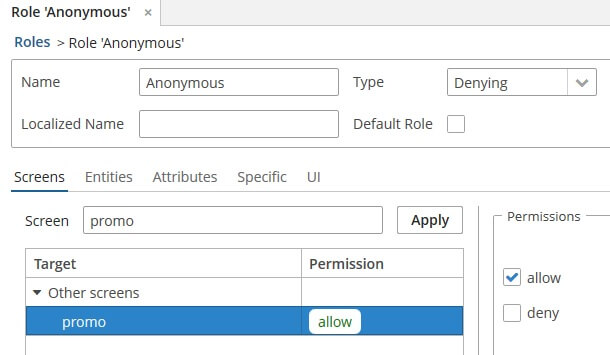
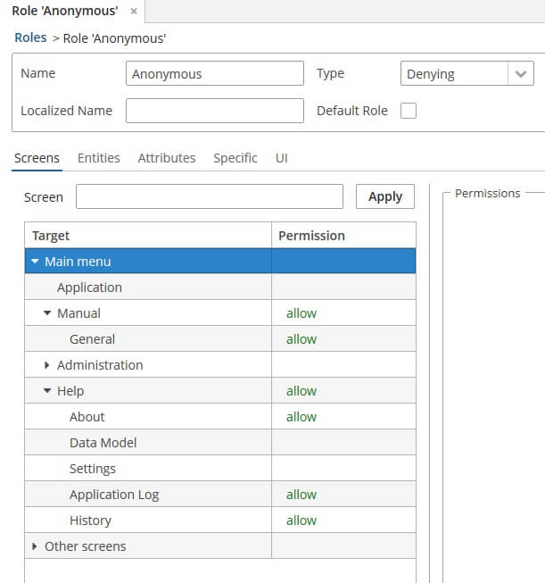
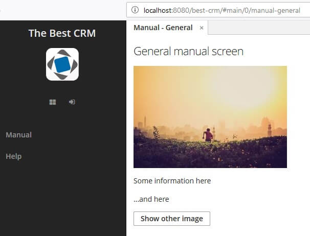
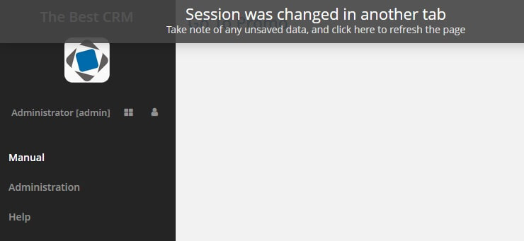
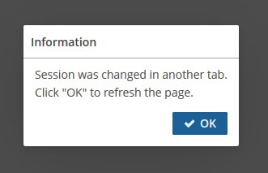
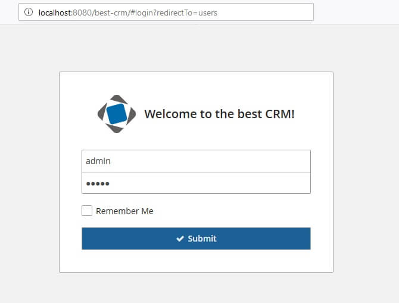

# CUBA Anonymous Access Demo

This sample demonstrates how public pages can be used.

Public pages are screens available both for authenticated and anonymous
users.

Based on CUBA 7.1

## Preliminary preparation

The only thing that should be done is to allow required screens for
`anonymous` user.

### Initial public page

`MainScreen` is set as initial screen with  the `cuba.web.initialScreenId`
app property (`web-app.properties` file).

It means that this screen will be opened instead of `LoginScreen` when
[http://localhost:8080/best-crm/](http://localhost:8080/best-crm/) address
will be opened.

Due to new `UserActionsButton` component is used instead of default
`LogoutButton` we are able to proceed to log in while working with app
as anonymous:

### Public root page

The sample contains `PromoScreen` that can be used as public page.

Let's allow this screen for `anonymous`:

1. Open `Anonymous` role in editor
2. Find `promo` screen
3. Tick `allow` checkbox
4. Restart the app

Now `PromoScreen` can be navigated by address:

[http://localhost:8080/best-crm/#promo](http://localhost:8080/best-crm/#promo)

### Public screens

Let's allow access to several more screens. The sample contains
`ManualGeneral` screen that has some text and random picture.

Give permissions for this and several more screens as it was done before:

And restart the app. Now `ManualGeneral` screen can be navigated without
authentication by address:

[http://localhost:8080/best-crm/#main/manual-general](http://localhost:8080/best-crm/#main/manual-general)

### Changed session notification

In situation when two authenticated sessions exist (logged in with 
different credentials in two different anonymous tabs) system notification
about changed session shows:

If notification is ignored modal dialog will be shown:

This behavior can be managed with `cuba.web.forceRefreshLoggedTabs` app
property. When this config is enabled a tab with mismatched user
session will be re-initialized automatically.

All authenticated tabs are always logged out simultaneously.

### Navigation

When a screen not permitted by security is navigated in anonymous
session user will be redirected to login screen and then requested
screen will be opened:

Screens allowed for `anonymous` can be opened and navigated as usual.

## Issues

Please use [https://www.cuba-platform.com/discuss](https://www.cuba-platform.com/discuss)
for discussion, support, and reporting problems corresponding to this
sample.